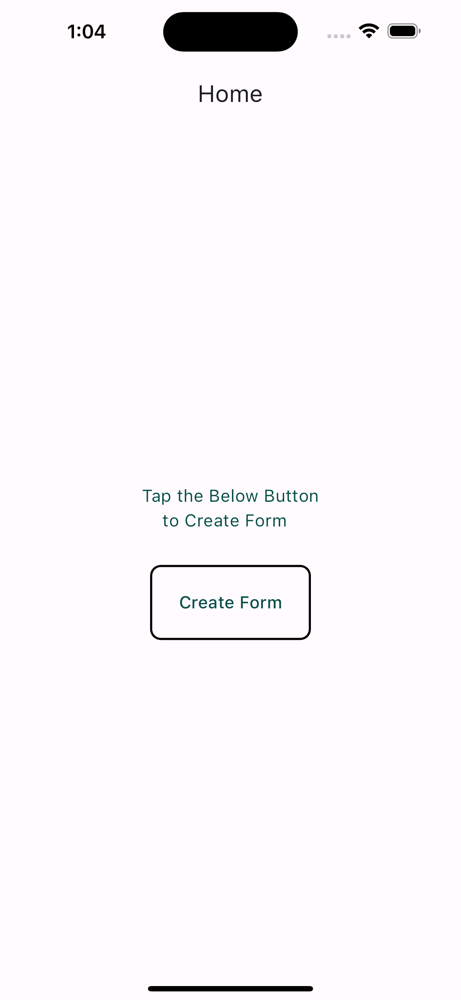
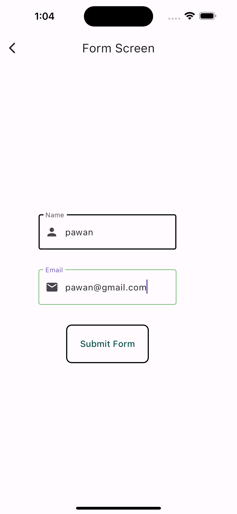
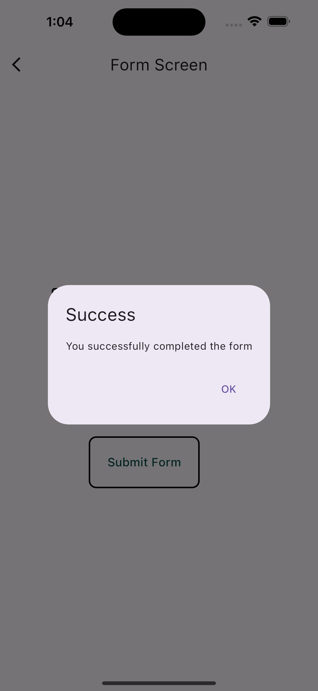

# Intern_Task

# Simple Flutter Form Submission App

Consists of 2 Screens

* The first screen displays a single button labeled "Go to Second Screen".
* Upon tapping this button, the app navigates to the second screen.
* The second screen displays a form with two fields: Name and Email.
* Users are required to input their name and email address into these fields.
* Basic form validation is implemented to ensure both fields are filled before submission.
* Upon successful validation and submission, an AlertDialog pops up confirming the successful completion of the form.
* The app uses Flutter's state management to handle the form state.
* It provides a simple and clean user interface with Material Design components like AppBar, TextFields, Buttons, and AlertDialog.
* The email field validation checks if the entered email follows a valid format using a regular expression.

#Screenshots of the App

 
 
